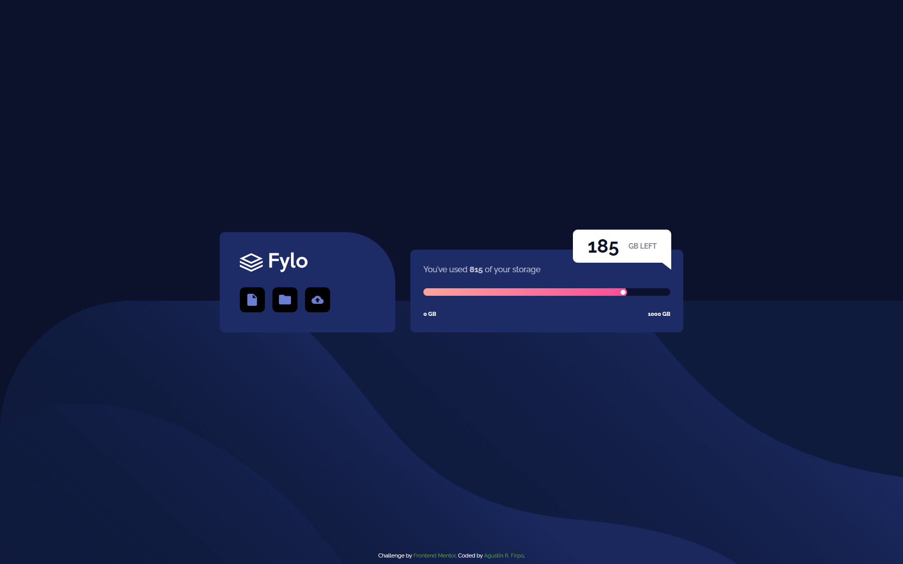

# Frontend Mentor - Fylo data storage component solution

Hi everybody! 👋

This is a solution to the [Fylo data storage component challenge on Frontend Mentor](https://www.frontendmentor.io/challenges/fylo-data-storage-component-1dZPRbV5n).

## Table of contents 🧾

- [Frontend Mentor - Fylo data storage component solution](#frontend-mentor---fylo-data-storage-component-solution)
  - [Table of contents](#table-of-contents)
  - [Overview](#overview)
    - [The challenge](#the-challenge)
    - [Links](#links)
  - [My process](#my-process)
    - [Built with](#built-with)
    - [What I learned](#what-i-learned)
    - [Useful resources](#useful-resources)
  - [Author](#author)

## Overview

### The challenge  🎯

Users should be able to:

- View the optimal layout for the site depending on their device's screen size
  
Mobile Layout 📱


Desktop Layout 💻



### Links  🔗

- Solution URL: [Github Repository](https://github.com/Arfirpo/fylo-data-storage-component-master)
- Live Site URL: [Github Page](https://arfirpo.github.io/fylo-data-storage-component-master/)

## My process ⚙️

### Built with 🛠️

- Semantic HTML5 markup
- BEM Methodology
- CSS custom properties
- Flexbox
- CSS Grid
- Mobile-first workflow
- Media Queries
- Javascript

### What I learned

This challenge allowed me to learn and practice how to configure an input range and how to use javascript to dynamically update the input color

```js
// Add an event listener for the 'load' event to update values and color on initial load
window.addEventListener('load', () => {
  // Get the current value of the input range as an integer
  const usedValue = parseInt(inputRange.value);
  
  // Update the content of HTML elements with used and remaining values
  storageUsed.innerText = usedValue;
  storageLeft.innerText = 1000 - usedValue;

  // Call the function to update the range color
  updateRangeColor();
});

// Add an event listener to the input range to update values and color
inputRange.addEventListener("input", () => {
  // Get the current value of the input range as an integer
  const usedValue = parseInt(inputRange.value);
  
  // Update the content of HTML elements with used and remaining values
  storageUsed.innerText = usedValue;
  storageLeft.innerText = 1000 - usedValue;

  // Call the function to update the range color
  updateRangeColor();
});

// Function to update the color of the range
function updateRangeColor() {
  // Calculate the percentage of the current value in relation to the maximum value and round the result
  const percent = Math.round((inputRange.value / inputRange.getAttribute('max')) * 100);

  // Update the background style of the input range with a linear gradient
  inputRange.style.background = `linear-gradient(to right, 
    hsl(6, 100%, 80%) 0%, 
    hsl(335, 100%, 65%) ${percent}%, 
    hsl(229, 57%, 11%) ${percent}%, 
    hsl(229, 57%, 11%) 100%)`;
}

```

## Author  🙋🏻‍♂️

- Twitter/X - [@agus_firpo](https://twitter.com/agus_firpo)
- Frontend Mentor - [@Arfirpo](https://www.frontendmentor.io/profile/Arfirpo)
- Linkedin - [Agustín Rodrigo Firpo](https://www.linkedin.com/in/agustin-rodrigo-firpo-0aa86697/)
